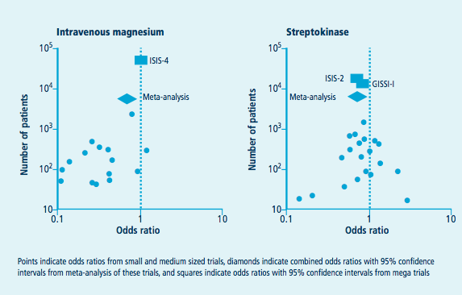

## Introduction to  
# Meta-Analysis

[Yuchen Wang](http://github.com/wangyuchen)  

Department of Statistics

East China Normal University

2013-05-15

## Outline
1. Binary Data   
	* Effect measures
	* Weights
	* Heterogeneity
	* Demo using Revman
2. Continuous Data
	* Effect measures
3. Publication bias
4. Sensitivity analyses
5. R task view & demo

## Binary Data
- - - - 

| Blum *et al*   | Still dyspeptic | Not still dyspeptic | Total |
|:----|:---------|----------:|:-------:|
| Treatment |   119 |     45   |  164  
| Control    |   130 |     34   |  164  
| Total | 249 | 79 | 328

### Effect measures

#### Risk Ratio (RR)
* risk of event on treatment = 119/164 = 0.726
* risk of event on control = 130/164 = 0.793
* risk ratio = 0.726 / 0.793 = 0.92
* risk ratio = 1 implies no difference in effect

#### Odds Ratio (OR)
* odds of event on treatment = 119/45 = 2.64
* odds of event on control = 130/34 = 3.82
* odds ratio = 2.64 / 3.82 = 0.69
* odds ratio = 1 implies no difference in effect

#### Risk Difference (RD)
* risk on treatment – risk on control
* 119/164 – 130/164 = 0.726 – 0.793 = -0.067 = -6.7%
* treatment reduced the risk of being dyspeptic by about 7 percentage points
* risk difference = 0 implies no difference in effect

### Weights

#### Mantel-Haenszel methods
| Study   | Event | No Event | Total |
|:----|:---------|----------:|:-------:|
| Treatment |   a |     b   |  n1  
| Control   |   c |     d   |  n2  

* when the effect measure is risk ratio,  
	the MH weight = c * (a + b) / (n1 + n2) 
* when the effect measure is odds ratio,  
	the MH weight = b * c / (n1 + n2) 
* when the effect measure is risk difference,  
	the MH weight = n1 * n2 / (n1 + n2) 

#### Inverse variance method
The individual effect sizes are weighted according to the reciprocal of their variance:  
inverse variance weight = 1 / Var(effect measure)

### Heterogeneity

>meta-analysis is a statistical analysis which combines or integrates the results of several independent clinical trials considered by the analyst to be "combinable"

#### Tests for Heterogeneity
* Cochran's Q, a test based on the chi-square test. Unfortunately, the test is thought to have low power.
* I-square test, it scores heterogeneity between 0% and 100%. A rule of thumb was proposed, with 25% corresponding to low heterogeneity, 50% to moderate and 75% to high. 

####  Fixed-effect model
If heterogeneity is absent, then the analysis employs what is termed fixed-effects modeling. This assumes the size of treatment effect is the same (fixed) across all studies and the variation seen between studies is due only to the play of chance. 

#### Random-effect model
Random-effects models assume that the treatment effect really does vary between studies. Such models tend to increase the variance of the summary measure, making it more difficult to obtain significant results.

### Demo using Revman

## Continuous Data
- - - - 

| Deliciozza *et al*   | Mean | Standard Deviation | Total |
|:----|:---------|----------:|:-------:|
| Treatment |   20 |     15.18   |  40  
| Control   |   30 |     20.24   |  40  

### Effect measures 
* mean difference (MD) between treatment and control = -10
* standardized mean difference (SMD), popular formulations of the SMD including Hedges’ adjusted g and Cohen's d.

### Publication bias

> Publication bias is a bias with regard to what is likely to be published, among what is available to be published.

#### Funnel plot
* A funnel plot is a scatterplot of treatment effect against a measure of study size. 
* It is used primarily as a visual aid to detecting bias or systematic heterogeneity. 

* When the standard error is used, straight lines may be drawn to define a region within which 95% of points might lie in the absence of both heterogeneity and publication bias.

* An asymmetric funnel indicates a relationship between treatment effect and study size. 
* This suggests the possibility of either publication bias or a systematic difference between smaller and larger studies (‘small study effects’).
* Asymmetry can also arise from use of an inappropriate effect measure.

### Sensitivity analyses

> Sensitivity analyses explore the ways in which the main findings are changed by varying the approach to aggregation.

### R task view & demo

# Thank You
Slides are available online at:  
[wangyuchen.github.com/slides/meta-analysis](wangyuchen.github.com/slides/meta-analysis)